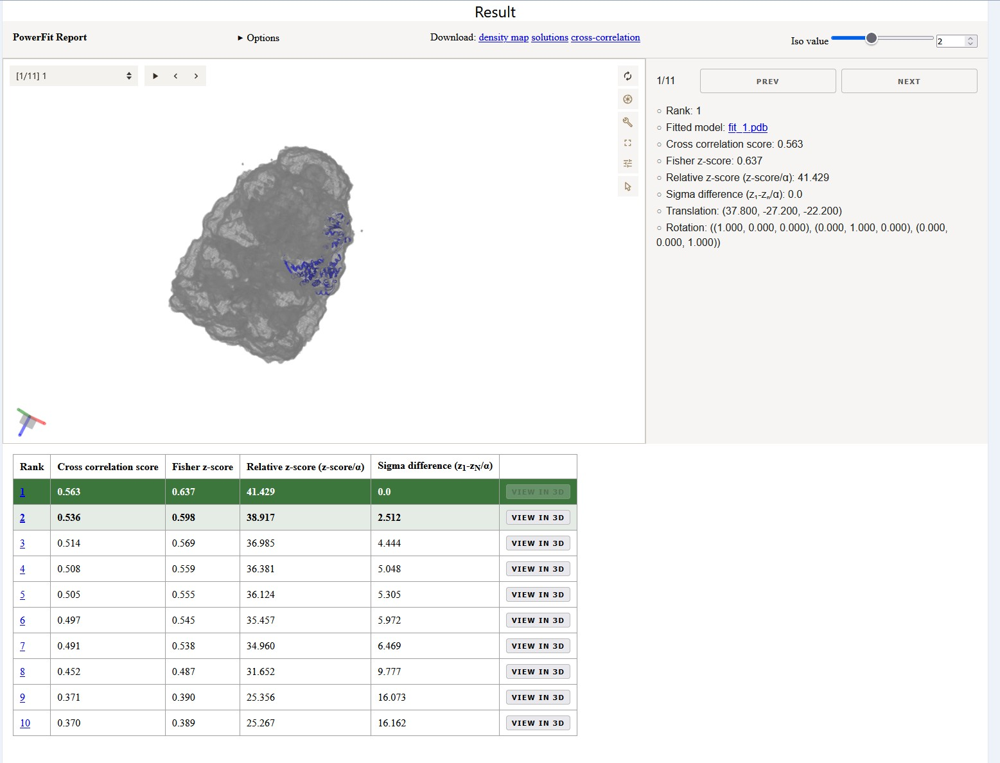
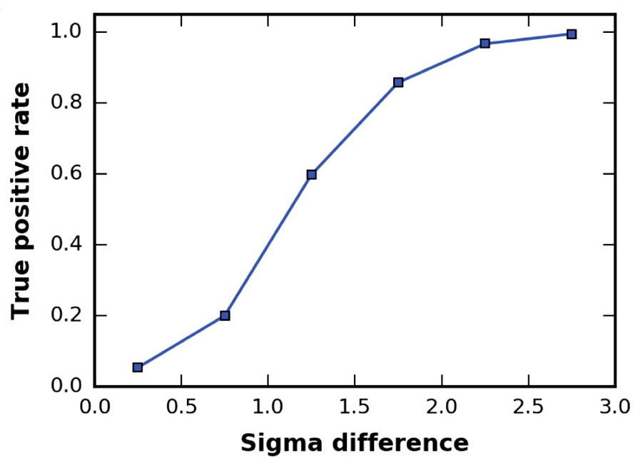

# User manual

There are a few default parameters listed below that come with the 
standard `powerfit` command. These default parameters are also the
standard in the [PowerFit webserver](https://rascar.science.uu.nl/powerfit).
Below we will describe the different parameters and some [input examples](#input-examples). 
In addition we also explain [the output](#report-page) of the *report.html*
file or result page on the webserver.

```shell
powerfit <map> <resolution> <pdb>
# To generate the report page after the run:
powerfit <map> <resolution> <pdb> --report --delimiter ','
```
## Parameters

**Rotational sampling interval (-a):** Rotational sampling density in degrees.
Increasing this number by a factor of 2 results in approximately 8 times
more rotations sampled.

**Chain ID(s) (-c):** The chain IDs of the structure to be fitted. Multiple
chains can be selected using a comma separated list, i.e. A,B,C.
The default is the whole structure.

**Laplace pre-filter (-nl)**: Usage of the Laplace pre-filter to filter the density data.
Can be combined with the core-weighted local cross-correlation. In the default this
is turned on and can be disabled by selecting *Disable Laplace pre-filter* in the 
webserver or using the `-nl` flag on the command line. 

**Core-weighted local cross-correlation (-ncw):** Usage of a core-weighted local cross-correlation
score. It can be combined with the Laplace pre-filter. In the default 
this is turned on and can be disabled by selecting *Disable Core-weighted correlation* 
in the webserver or using the `-ncw` flag on the command line.

**Number of top solutions (-n):** Number of top solutions for which the model in the coordinate 
frame of the density map will be returned. This number will be capped if less solutions are found
as requested. The default is 10.

**Density map resampling (-nr):** Resample the density map prior to fitting. In the default
this is turned on and can be disabled by selecting *No resampling* in the webserver or using
the `-nr` flag on the command line.

**Resampling rate (-rr):** Adjust resampling of the density map to a specific factor of the
Nyquist rate. The default is 2.

**Density map trimming (-nt):** Trim the density to a preddefined intensity cutoff. 
In the default this is turned on and can be disabled by selecting *No trimming* in 
the webserver or using the `-nt` flag on the command line.

**Trimming cutoff (-tc):** Intensity cutoff to which the map will be trimmed. 
Default is 10 percent of the maximum intensity.

In most cases the default parameters of PowerFit will be reasonable and don't
have to be changed. In cases where the fitting results are unsatisfactory,
improvements might be achieved by disabling the Laplace pre-filter, disabling
the core-weighted correlation, or increasing the rotational samping. Increasing
rotational sampling by a factor of 2 results in approximately 8 times more
rotations and thus a signigicant increase in the runtime of a job.

## Input examples

First, to see all options and their descriptions type

```shell
powerfit --help
```
You can also see all the options in the [CLI Reference](cli.md).
The information should explain all options decently. In addtion, here are some
examples for common operations. These examples can also be used in the webserver
by adapting the Optional Parameters. 

To perform a search with an approximate 24&deg; rotational sampling interval
with laplace pre-filtering and core-weighted scoring function using 1 CPU

```shell
powerfit <map> <resolution> <pdb> -a 24
```

To use multiple CPU cores without laplace pre-filter and 5&deg; rotational
interval

```shell
powerfit <map> <resolution> <pdb> -p 4 -nl -a 5
```

To off-load computations to the GPU and do not use the core-weighted scoring function
and write out the top 15 solutions

```shell
powerfit <map> <resolution> <pdb> -g -ncw -n 15
```

Note that all options can be combined except for the `-g` and `-p` flag:
calculations are either performed on the CPU or GPU.

To run on GPU

```shell
powerfit <map> <resolution> <pdb> --gpu
...
Using GPU-accelerated search.
...
```
(See `--help` if you have multiple GPUs and want to specify which one to use)

## Output

When the search is finished, several output files are created. These output 
files can be downloaded from the result page when run on the webserver and 
are automatically created and saved when run using the CLI.

* *fit_N.pdb*: the top *N* best fits.
* *solutions.out*: all the non-redundant solutions found, ordered by their
correlation score. The first column shows the rank, column 2 the correlation
score, column 3 and 4 the Fisher z-score and the number of standard deviations
(see N. Volkmann 2009, and Van Zundert and Bonvin 2016); column 5 to 7 are the
x, y and z coordinate of the center of the chain; column 8 to 17 are the
rotation matrix values.
* *lcc.mrc*: a cross-correlation map, showing at each grid position the highest
correlation score found during the rotational search.
* *powerfit.log*: a log file, including the input parameters with date and
timing information.
* *report.html* and *state.mvsj*: an HTML report and its [MolViewSpec](https://molstar.org/mol-view-spec/) with interactive 3D visualization of the best fits.
  Only written if the `--report --delimiter ,` arguments are passed.



## Report page

At the top of the report page is an interactive [MolViewSpec](https://molstar.org/mol-view-spec/) 
with 3D visualization of the best fits. It shows the best 15 non-redundant solutions found by 
PowerFit as reported in the *solutions.out* file. While clicking through the different models, 
the viewer reports the rank, cross correlation score, Fisher z-score, and Sigma difference.
 When opening the Options dropdown you can see which parameters where used for the fitting.

### Solutions table
The table below the interactive viewer reports the values of the models in one overview. 
In a previous investigation we fitted 379 individual chains in 6 ribosome cryo-EM density 
maps starting at a resolution of 6Å up to 30Å. Successful fits were obtained in >99% of the
cases for which the difference in error-normalized z-score between the two top scoring solutions 
was larger than ~2.5. Conversely, in less than 3% of the failed cases did the difference exceed 
one. [Van Zundert and Bonvin 2016](https://www.sciencedirect.com/science/article/pii/S1047847716301174)


*The true-positive rate is given versus the difference in Fisher z-score standard deviations 
between the top 2 solutions. The fitting results were binned in 6 bins, starting from 0 to 3 
sigma with a step size of 0.5.*

To enhance the interpretation of the results, the entries in the table are colored in a green 
gradient up to a sigma difference of 3. Coloring is however only applied if the sigma difference 
to Fit 10 is below 3 in order to avoid higlighting runs with no distinction between the fits.
Note that in case of symmetrical complexes multiple equally well scoring fits might be reported.